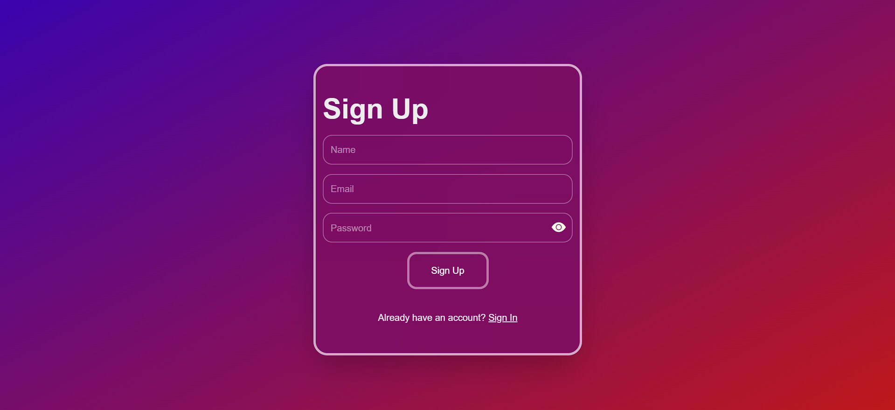

# CRUD-sign-in-up
# 
Next.js Authentication CRUD Application

  
  
  
  

## ONLINE DEMO

## 🚀 Features

- 🔐 **User Authentication**: Secure sign-up and sign-in functionality
- 📝 **CRUD Operations**: Full Create, Read, Update, Delete capabilities
- ✅ **Form Validation**: Robust form handling with Formik
- 🧠 **State Management**: Efficient context-based state management
- 📱 **Responsive Design**: Clean UI built with Tailwind CSS
- 🌐 **Mock Backend**: Powered by MockAPI for rapid development and testing

## 🛠️ Tech Stack

- **Frontend**: Next.js, React, Formik, Tailwind CSS
- **Validation**: Formik
- **State Management**: React Context API
- **Backend**: MockAPI.io (fake REST API service)
- **Styling**: Tailwind CSS with custom components

 # SCREEN-SHOT

